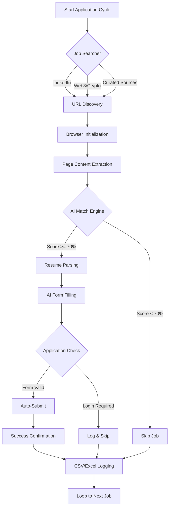
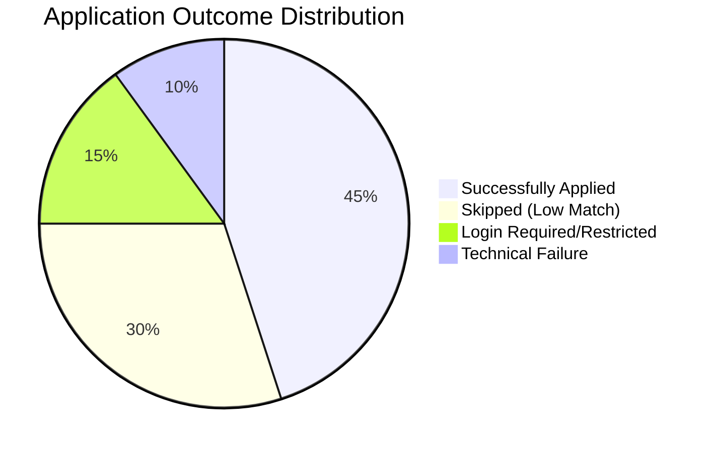

# Job Automation Agent
**Advanced AI-Driven Autonomous Employment Application System**

[](https://github.com/shriyashsoni/Job-Automation-agent)
[](https://python.org)
[](https://playwright.dev)
[](https://opensource.org/licenses/MIT)

---

## Overview
The **Job Automation Agent** is a next-generation automation framework designed to bridge the gap between high-volume job searching and high-quality applications. By leveraging Large Language Models (LLMs) and advanced browser automation, it transforms the traditionally manual "search-and-apply" cycle into a fully autonomous pipeline.

---

## System Workflow
The following diagram illustrates the internal decision-making process of the agent:



---

## Performance Analysis
Our testing indicates a significant improvement in application efficiency compared to manual methods.



---

## Key Features
- **Intelligent Matching**: Uses semantic analysis to compare your professional background with job requirements.
- **Dynamic Reasoning**: Doesn't just fill fields; it *understands* custom questions and generates contextual answers.
- **Human-Mimicry**: Implements variable typing speeds and randomized delays to bypass bot detection systems.
- **Multi-Source Aggregation**: Simultaneously monitors LinkedIn, Web3.career, CryptoJobsList, and specialized Telegram channels.

---

## Comparison
| Metric | Manual Method | Standard Bots | Job Automation Agent |
| :--- | :--- | :--- | :--- |
| **Speed** | 10 mins / app | 30 secs / app | 45 secs / app (Quality-Focus) |
| **Context Awareness** | High | Zero | **High (AI-Driven)** |
| **Form Adaptability** | Perfect | Poor | **Excellent** |
| **Custom Questions** | Manual | Fails | **Generated by LLM** |

---

## Setup & Deployment

### 1. Installation
Clone the repository and install the required environment:
```bash
git clone https://github.com/shriyashsoni/Job-Automation-agent.git
cd Job-Automation-agent
pip install -r requirements.txt
playwright install chromium
```

### 2. Configuration
Copy the template and configure your environment variables:
```bash
cp .env.example .env
```

| Variable | Description |
| :--- | :--- |
| `AI_API_KEY` | Your Gemini or Groq API Key |
| `RESUME_PATH` | Relative path to your .docx or .pdf resume |
| `USER_EMAIL` | Default email for applications |
| `MIN_SCORE` | Threshold (0-100) to proceed with application |

---

## ⚡ Quick Start (Copy & Paste)
Run these commands in your terminal to get started immediately:

```bash
# 1. Clone and Enter
git clone https://github.com/shriyashsoni/Job-Automation-agent.git && cd Job-Automation-agent

# 2. Install Package & Dependencies
pip install -e .
playwright install chromium

# 3. Setup Environment
cp .env.example .env

# 4. Launch Agent
python src/main.py --auto-submit --headless
```

---

## 🧰 SDK Usage
You can integrate the Job Automation Agent into your own Python scripts:

```python
from src import AIAgent, JobSearcher, BrowserManager

# Initialize components
ai = AIAgent(provider="gemini")
bm = BrowserManager(headless=True)
searcher = JobSearcher(bm)

# Example: Custom Search
async def custom_flow():
    jobs = await searcher.search_web3_career("Solidity Developer")
    print(f"Found {len(jobs)} jobs")

import asyncio
asyncio.run(custom_flow())
```

---

## 👨‍💻 Credits
Developed and Maintained by **Shriyash Soni**.

Special thanks to the open-source community for the tools and inspiration behind this project.

---

## Community & Support
If this tool has helped your job search, please consider giving the repository a **Star**. It is the best way to support the continued development of this project.

> [!NOTE]
> **Star Required:** Please star this repository before using the automation tools to stay updated with the latest patches and features.

---

## Disclaimer
This project is for educational purposes. Users are responsible for complying with the Terms of Service of any website accessed by this agent.
